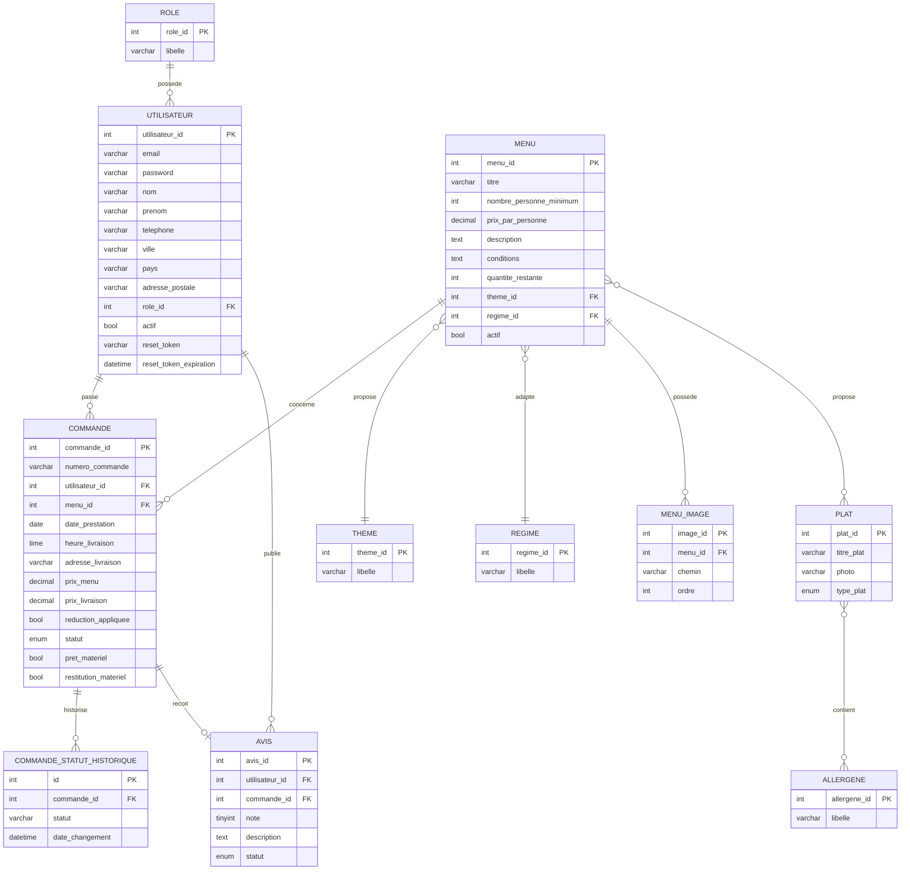
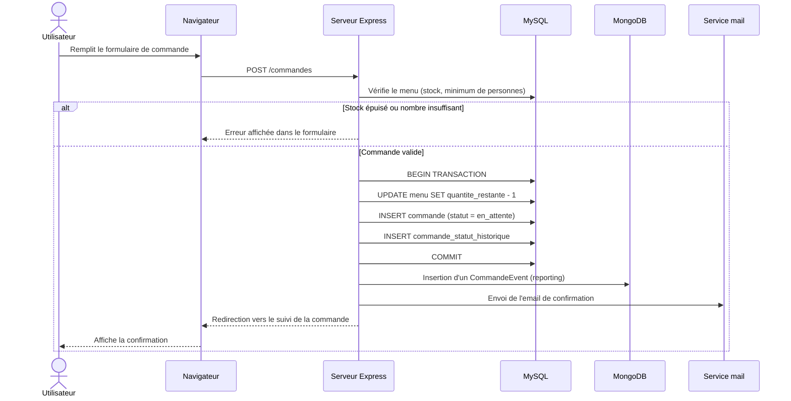

# Documentation technique — Vite & Gourmand

## 1. Réflexions technologiques initiales

Le sujet n'impose aucune techno précise, à l'exception d'une base de données relationnelle et d'une base non relationnelle. Les choix suivants ont été faits :

| Choix | Alternative envisagée | Pourquoi ce choix |
|---|---|---|
| **Node.js / Express** | PHP (proposé en exemple par le sujet) | Un seul langage (JavaScript) côté front et back, écosystème npm riche, plus simple à déployer sur des plateformes cloud modernes (Railway, Render...) sans configuration serveur PHP/Apache. |
| **EJS** (rendu côté serveur) | React / Vue (SPA) | Pas d'étape de build, pas de séparation API/front à gérer en plus, adapté à une équipe d'une seule personne sur un délai contraint. Les parties qui doivent être dynamiques sans rechargement (filtres, graphiques) sont gérées avec de simples appels `fetch()` vers des routes JSON. |
| **MySQL** | PostgreSQL, MariaDB | Base relationnelle la plus répandue, correspond à l'annexe MCD fournie, bien supportée par les plateformes d'hébergement. |
| **MongoDB** | — | Imposé par le sujet pour les statistiques de commandes. Utilisé comme journal d'événements (`commande_events`), un cas d'usage naturel du NoSQL : écritures fréquentes, schéma simple, agrégations pour le reporting. |
| **bcryptjs** | bcrypt (natif) | `bcrypt` nécessite une compilation native (node-gyp) qui a posé des soucis d'environnement Windows en local ; `bcryptjs` est une implémentation pure JavaScript, aussi sûre, sans dépendance de compilation — plus simple à déployer partout. |
| **connect-mongo** (store de session) | Store en mémoire (par défaut) | Le store par défaut d'`express-session` n'est pas prévu pour la production (fuite mémoire, non partagé entre instances). Comme MongoDB est déjà utilisé dans le projet, `connect-mongo` réutilise cette base sans dépendance supplémentaire. |
| **multer** | Stockage des images en BLOB (comme suggéré par le MCD pour `plat.photo`) | Stocker des fichiers binaires dans une base relationnelle alourdit les sauvegardes et les requêtes. Les images sont stockées sur disque (`public/uploads/`) et seul le chemin est stocké en base — pratique standard. |

## 2. Configuration de l'environnement de travail

Voir le [README.md](../README.md) pour la procédure complète d'installation (Node.js, MySQL, MongoDB, variables d'environnement, scripts SQL).

Environnement de développement utilisé :
- Windows 11
- Node.js 24 (LTS)
- MySQL Community Server 8.4 (service Windows local)
- MongoDB Community Server (service Windows local)
- Éditeur : VS Code / Claude Code
- Gestion de versions : Git + GitHub (dépôt public [Wazooow/vite-et-gourmand](https://github.com/Wazooow/vite-et-gourmand))

## 3. Modèle de données

### 3.1 Modèle conceptuel de données (relationnel — MySQL)

Le script SQL complet (avec tables d'association `menu_plat` et `plat_allergene`) se trouve dans [`database/schema.sql`](../database/schema.sql).

**Écarts par rapport à l'annexe MCD fournie**, et justifications :
- Ajout de `nom` sur `utilisateur` (absent du schéma fourni, pourtant requis par le texte du sujet).
- `menu.regime` (texte libre dans l'annexe) remplacé par la seule relation vers `regime` — normalisation, évite la redondance.
- Ajout de `menu.conditions`, `menu_image` (galerie), `commande.adresse_livraison`/`ville_livraison`/`code_postal_livraison`/`distance_km`, `utilisateur.reset_token`/`reset_token_expiration`, `commande_statut_historique` — attributs et une table nécessaires aux fonctionnalités demandées mais absents du MCD fourni.
- `avis.note` en `TINYINT` avec contrainte `CHECK (note BETWEEN 1 AND 5)` plutôt qu'en `VARCHAR` — cohérence du type de donnée.
- Clé technique `commande_id` auto-incrémentée ajoutée en plus de `numero_commande` (référence métier lisible, générée après insertion).

### 3.2 Base non relationnelle (MongoDB)

Une seule collection, `commande_events`, alimentée par l'application à chaque commande créée (voir [`src/models/CommandeEvent.js`](../src/models/CommandeEvent.js)). Elle sert exclusivement au reporting de l'espace administrateur (nombre de commandes et chiffre d'affaires par menu, avec filtres période/menu), via des agrégations Mongoose (`$match`, `$group`).

MySQL reste la source de vérité transactionnelle ; MongoDB est un journal d'événements en lecture seule pour les statistiques — un motif classique (event log + agrégation) qui évite de complexifier le modèle relationnel avec des besoins purement analytiques.

## 4. Diagramme de cas d'utilisation

```mermaid
graph TB
    Visiteur((Visiteur))
    Utilisateur((Utilisateur))
    Employe((Employé))
    Admin((Administrateur))

    Visiteur --> UC1[Consulter les menus]
    Visiteur --> UC2[Créer un compte]
    Visiteur --> UC3[Contacter l'entreprise]

    Utilisateur --> UC1
    Utilisateur --> UC4[Se connecter]
    Utilisateur --> UC5[Passer une commande]
    Utilisateur --> UC6[Suivre / modifier / annuler une commande]
    Utilisateur --> UC7[Laisser un avis]
    Utilisateur --> UC8[Gérer ses informations]

    Employe --> UC4
    Employe --> UC9[Gérer menus / plats / horaires]
    Employe --> UC10[Traiter les commandes]
    Employe --> UC11[Modérer les avis]

    Admin --> UC4
    Admin --> UC9
    Admin --> UC10
    Admin --> UC11
    Admin --> UC12[Gérer les comptes employés]
    Admin --> UC13[Consulter les statistiques]
```

## 5. Diagramme de séquence — Passer une commande

## 6. Sécurité

- Mots de passe hashés avec `bcryptjs` (jamais stockés en clair).
- Politique de mot de passe imposée (10 caractères min., majuscule, minuscule, chiffre, caractère spécial) à l'inscription, à la création de compte employé et à la réinitialisation.
- Réinitialisation de mot de passe par token aléatoire (`crypto.randomBytes`) à usage unique, expirant après 1h.
- Sessions serveur (`express-session`) plutôt que des tokens stockés côté client, avec cookie `httpOnly` et `secure` en production.
- Autorisation par rôle via un middleware dédié (`requireRole`), vérifié sur chaque route sensible.
- Requêtes SQL paramétrées (`mysql2`, placeholders `?`) — pas de concaténation de chaînes, protection contre les injections SQL.
- Le mot de passe d'un compte employé n'est jamais transmis par email (conformément au sujet) : l'admin le communique de vive voix.

## 7. Démarche de déploiement

Voir la section [Déploiement du README](../README.md#déploiement) pour la procédure complète (Railway, variables d'environnement, initialisation de la base en production).
